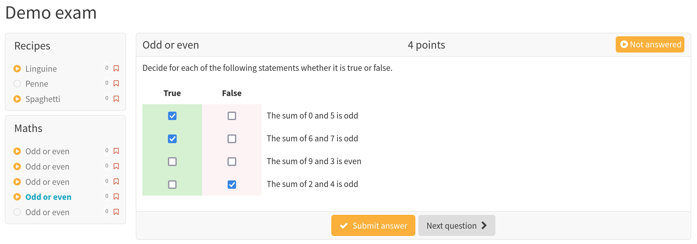

## About The Project

[The IMS Question & Test Interoperability (QTI®) specification, Version 2.1](https://www.imsglobal.org/question/qtiv2p1/imsqti_mdudv2p1.html) is widely used by e-learning and assessment tools. This library enables programmatic creation of tests. The resulting zip file can be imported by tools supporting QTI 2.1.


## Usage

The following code...

   ```python
   import random
   from pyqti.qti import Qti
   from pyqti.item import Section, Essay, Kprim

   # Section will contain 5 out of all available questions
   maths = Section("Maths", select=5)
   # Generate 100 Kprim questions
   for i in range(100):
      statements, answers = [], []
      # Each question contains 4 math problems
      for i in range(4):
          x, y = random.sample(range(0, 10), 2)
          rest = (x + y) % 2
          target = random.choice([0, 1])
          target_name = "even" if target == 0 else "odd"
          statements.append(f"The sum of {x} and {y} is {target_name}")
          answers.append(True if target == rest else False)
      item = Kprim(4, "Odd or even", statements, answers)
      # Add each question to the section
      maths.add(item)

   pasta = Section("Recipes")
   # Generate three essay questions
   for i, p in enumerate(["Spaghetti", "Penne", "Linguine"], 1):
      item = Essay(10, p,
             f"""<p>Share your favourite {p.lower()} recipe</p>""",
             uuid=f"pasta{i:02d}")
      # Add each question to the section
      pasta.add(item)

   sections = [pasta, maths]
   qti = Qti("Demo exam", sections, navigation_mode="nonlinear")
   zip_path = f"my-exam.zip"
   qti.save_as(zip_path)

   ```

...produces the following output when imported into [OLAT LMS](https://github.com/OpenOLAT/OpenOLAT)



See [/demo/large.py](/dem/large.py) for more examples.

## Roadmap

- [x] Create QTI XML and ZIP files
- [x] Support for (nested) sections, essays and kprim questions
- [ ] Support for other item types (SC/MC etc.)

Support for item types will be added when needed. Please leave a feature request on the issue tracker. Pull requests welcome.

## Supporting additional item types

Implementing new item types is straight-forward:

- Pick a suitable name for the item type (e.g. "kprim")
- Create an item in your LMS
- Export the test from your LMS as a zip file
- Find the item's XML file and copy it to `pyqti/templates`, naming it appropriately (e.g. "kprim.xml")
- Find the relevant section in `imsmanifest.xml` which references the item's XML file
- Create a new snippet file (e.g. `pyqti/template/manifest_kprim.xml`) and copy the relevant snippet from `imsmanifest.xml`
- In both newly created XML templates, replace strings by placeholders (`${xyz}`) where necessary
- Create a new `Item` subclass in `pyqti/item.py`
   - The classname must correspond to the type name (e.g. "Kprim")
   - implement `__init__`: it must set `self.data` to a dictionary that will be used to populate the template.

See the existing implementations at the bottom of `pyqti/item.py` and the corresponding templates in `pyqti/templates` as a guideline.

## License

Distributed under the BSD 3-Clause License. See `LICENSE` for more information.

